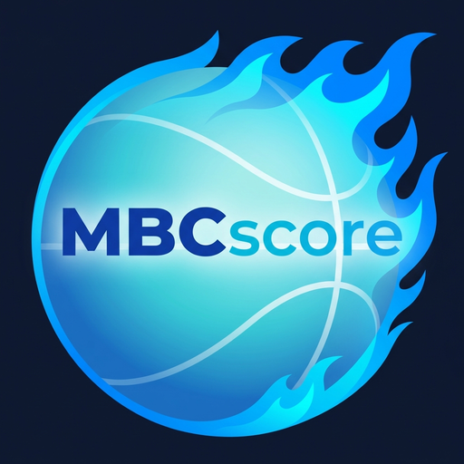

# 🏀 試合の感動を、指先ひとつで記録。
**ミニバス専用 デジタルスコアシート「MBCscore」**

*スマホ・タブレットが、あなた専用の高性能スコアボードに生まれ変わります！*

---

### ✨ MBCscoreの「ココがすごい！」3大機能

#### 1️⃣ コートから目を離さない！「フリック」で高速入力
得点が入ったら**「上フリック」**、外れたら**「下フリック」**。
直感的な操作で、白熱する試合のテンポを崩さずにスピーディーな記録が可能！画面を見つめる時間を減らし、子供たちの素晴らしいプレーをしっかりその目で見届けられます。

#### 2️⃣ 「今の誰？」迷っても安心。「アクション保留」機能
「あ！今のシュート、背番号が見えなかった…」
そんな時でも焦る必要はありません。まずは得点だけを記録しておき、選手が分かった時点で後から紐付けることができる「保留機能」を搭載。記録漏れやパニックを徹底的に防ぎます。

#### 3️⃣ ワンタップで完成！「JBA準拠スコアシート」自動生成
試合中の記録から、日本バスケットボール協会(JBA)準拠の美しい公式スコアシートを自動生成！面倒なクォーターごとの点数計算も、斜線の記入も自動。そのままPDFや画像でエクスポートして、チームのグループLINE等ですぐに共有できます。

---

### 💡 記録係を助ける、もっと便利な機能

- **📸 カメラで一発！OCR選手登録**
  もらったメンバー表をスマホでパシャッと撮るだけ。AIが文字を読み取って、面倒な手入力なしであっという間に選手登録が完了します。
- **📱 スマホでもiPadでも。最適な2つのモード**
  広々使えるiPad向けの「フルモード」と、スマホでの片手操作に特化した縦型「シンプルモード」を切り替え可能。
- **📶 電波の悪い体育館でもサクサク動く**
  ブラウザのメニューから「ホーム画面に追加」するだけでアプリとしてインストール完了！オフライン対応なので、電波の届かない体育館でもサクサク動作します。
- **💾 大切な記録はしっかり守る**
  新しいスマホに機種変更しても大丈夫。フルバックアップ機能や、後から表計算ソフトで分析できるCSVエクスポート機能を追加し、大切なデータを安全に管理できます。

---

**⬇️ さあ、今すぐ始めよう！ ⬇️**

### 🔗 [MBCscore を開く](https://boningori.github.io/MBCscore_pr/)

`https://boningori.github.io/MBCscore_pr/`

お使いのブラウザメニューから**「ホーム画面に追加」**を選ぶだけで、いますぐアプリとして利用開始できます！

※ インストール不要・登録不要・完全無料

