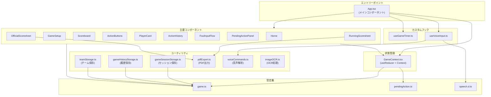
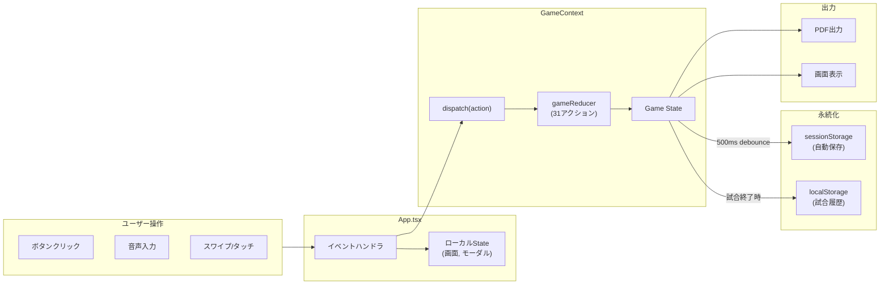
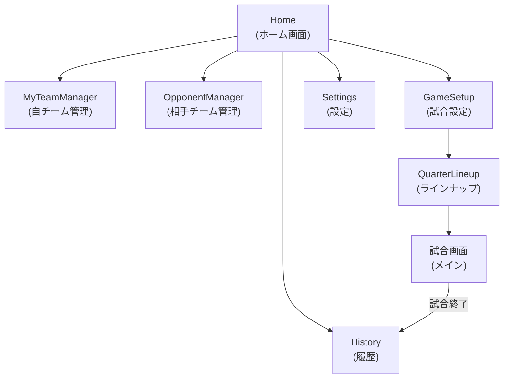

# MBCscore プロジェクトマップ

## 概要

MBCscoreは、ミニバスケットボールの試合記録・統計管理用のPWAアプリケーションです。React 19 + TypeScript + Viteで構築されています。

---

## 1. ディレクトリ構成

```
src/
├── App.tsx                    # メインアプリ (ルーティング・状態管理の中心)
├── App.css                    # グローバルスタイル
│
├── components/                # UIコンポーネント (29個)
│   ├── ActionButtons/         # 得点・スタッツ入力ボタン (スワイプ対応)
│   ├── ActionHistory/         # アクション履歴タイムライン
│   ├── EditActionModal/       # 過去エントリの編集モーダル
│   ├── FoulInputFlow/         # ファウル入力ワークフロー (FT選択含む)
│   ├── FoulTypeSelector/      # ファウル種別選択UI
│   ├── GameSetup/             # 試合初期設定
│   ├── History/               # 過去試合の履歴表示
│   ├── Home/                  # ホーム画面・ナビゲーション
│   ├── MyTeamManager/         # 自チーム管理
│   ├── OfficialScoresheet/    # JBA形式オフィシャルスコアシート
│   ├── OpponentManager/       # 対戦相手管理
│   ├── OpponentSelect/        # 相手チーム選択 (履歴から)
│   ├── PendingActionPanel/    # 未解決アクションのフローティングUI
│   ├── PendingActionResolver/ # 未解決アクション解決モーダル
│   ├── PlayerCard/            # 選手個人スタッツ表示
│   ├── QuarterLineup/         # クォーター別ラインナップ選択
│   ├── RunningScoresheet/     # ランニングスコアシート (エクスポート対応)
│   ├── Scoreboard/            # スコアボード (Q表示・ゲームコントロール)
│   ├── Settings/              # 設定画面 (OCR設定等)
│   ├── StatsPanel/            # チーム統計パネル
│   ├── SubstitutionModal/     # 選手交代モーダル
│   ├── TeamManager/           # 汎用チーム管理
│   ├── TeamSetup/             # チーム作成・編集
│   └── VoiceInput/            # 音声入力インターフェース
│
├── context/
│   └── GameContext.tsx        # 中央状態管理 (useReducer + Context)
│
├── hooks/
│   ├── useGameTimer.ts        # 試合タイマー管理
│   └── useVoiceInput.ts       # 音声認識フック
│
├── types/
│   ├── game.ts                # コア型定義 (Game, Team, Player等)
│   ├── pendingAction.ts       # 未解決アクション型
│   └── speech.d.ts            # Web Speech API型定義
│
└── utils/
    ├── gameHistoryStorage.ts  # 過去試合の永続化
    ├── gameSessionStorage.ts  # 現在セッションのキャッシュ
    ├── imageOCR.ts            # Tesseract.js OCRラッパー
    ├── pdfExport.ts           # PDF出力 (html2canvas + jspdf)
    ├── storage.ts             # localStorage汎用ヘルパー
    ├── teamStorage.ts         # チームデータ永続化
    └── voiceCommands.ts       # 音声コマンドパーサー
```

---

## 2. 各ディレクトリの役割

| ディレクトリ | 役割 |
|------------|------|
| `components/` | UIコンポーネント群。各機能ごとにフォルダ分け |
| `context/` | アプリ全体の状態管理 (GameContext) |
| `hooks/` | 再利用可能なカスタムフック |
| `types/` | TypeScript型定義 |
| `utils/` | ユーティリティ関数・永続化ロジック |

---

## 3. コアデータモデル

```typescript
Game
├── teamA, teamB: Team
│   ├── players: Player[]
│   │   ├── stats: PlayerStats (points, rebounds, assists...)
│   │   ├── fouls: FoulRecord[]
│   │   └── isOnCourt: boolean
│   ├── teamFouls: number[4]  // クォーター別
│   └── timeouts: Timeout[]
├── currentQuarter: 1-4
├── phase: 'setup' | 'playing' | 'paused' | 'quarterEnd' | 'finished'
├── scoreHistory: ScoreEntry[]
├── statHistory: StatEntry[]
├── foulHistory: FoulEntry[]
└── pendingActions: PendingAction[]
```

---

## 4. モジュール依存関係図



---

## 5. データフロー図



---

## 6. 画面遷移フロー



---

## 7. Reducerアクション一覧

| カテゴリ | アクション |
|---------|-----------|
| **フェーズ** | SET_TEAMS, START_GAME, PAUSE_GAME, RESUME_GAME, END_QUARTER, END_GAME, RESET_GAME |
| **得点** | ADD_SCORE, REMOVE_SCORE, EDIT_SCORE, CONVERT_SCORE_TO_MISS, CONVERT_MISS_TO_SCORE |
| **スタッツ** | ADD_STAT, REMOVE_STAT, EDIT_STAT |
| **ファウル** | ADD_FOUL, ADD_FOUL_WITH_FREE_THROWS, REMOVE_FOUL |
| **管理** | SUBSTITUTE_PLAYER, ADD_TIMEOUT, SELECT_PLAYER, CLEAR_SELECTION |
| **未解決** | ADD_PENDING_ACTION, RESOLVE_PENDING_ACTION, RESOLVE_PENDING_ACTION_WITH_FOUL_TYPE, UPDATE_PENDING_ACTION_CANDIDATES, REMOVE_PENDING_ACTION |
| **セッション** | RESTORE_GAME |

---

## 8. localStorage キー一覧

| キー | 用途 |
|-----|------|
| `minibasket-my-teams` | 自チームロスター |
| `minibasket-opponent-teams` | 対戦相手履歴 |
| `minibasket-game-session` | 現在の試合キャッシュ |
| `minibasket-game-history` | 過去試合アーカイブ |

---

## 9. 主要技術スタック

- **フレームワーク**: React 19.2.0
- **言語**: TypeScript 5.9.3
- **ビルド**: Vite 7.2.4
- **PDF出力**: html2canvas + jspdf
- **OCR**: Tesseract.js / Google Gemini AI
- **音声認識**: Web Speech API

---

## 10. 特徴的な機能

### Pending Actions (未解決アクション)
試合中に「誰がしたかわからないがアクションが発生した」場合に、アクションを一時保存し後から選手を割り当てる仕組み。

### ランニングスコア自動計算
得点履歴を時系列でソートし、累積スコアを自動再計算。編集・削除後も整合性を保つ。

### Full/Simpleモード切替
- **Fullモード**: タブレット向け3カラムレイアウト
- **Simpleモード**: スマホ向け1カラムレイアウト
